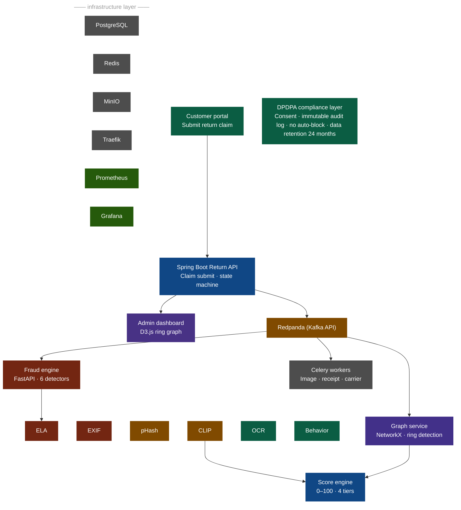

# 🛡️ TriNetra AI v3.0 — Production Fraud Intelligence Platform

> **Zero paid dependencies. 100% open-source. DPDPA 2023 compliant.**

TriNetra AI is a production-grade, multi-layered return-fraud detection system for high-volume e-commerce platforms. It protects against image manipulation, receipt forgery, INR abuse, wardrobing, and coordinated fraud ring attacks — while ensuring frictionless approvals for the **94% of legitimate customers**.

---

## 🏗️ System Architecture

Our architecture is built on a modern, event-driven, Python and JavaScript stack, optimized for real-time computer vision inference and graph analysis.



### Modern Open-Source Stack
| Component | Technology |
|---|---|
| Frontend Framework | React 18 + Vite |
| Backend API | FastAPI / Python 3.10+ |
| Database | MongoDB Atlas |
| Visual AI | HuggingFace CLIP (local inference), TensorFlow |
| Image Forensics | PIL/Pillow (ELA), imagehash, EXIF tools |
| Graph Visualization| Recharts, Force-Directed Graphs |
| Device Capture | HTML5 Geolocation API, IP Webcam Integration |

---

## 🚀 Quick Start

### Step 1 — Setup Environment

Copy the environment template and configure your MongoDB Atlas connection.

```powershell
copy .env.example .env
# Edit .env to add your MONGODB_URI
```

### Step 2 — Start the Fraud Engine Backend (FastAPI)

```powershell
cd services\fraud-engine
pip install -r requirements.txt

# Start the server on port 8000 (accessible on local network)
uvicorn main:app --port 8000 --host 0.0.0.0 --reload
```

### Step 3 — Start Frontend Apps (Vite)

**Admin Dashboard:**
```powershell
cd dashboard
npm install
npm run dev
# Running on http://localhost:5173
```

**Customer Portal:**
```powershell
cd customer-portal
npm install
npm run dev
# Running on http://localhost:5174
```

---

## 🔗 Service URLs

| Service | URL | Description |
|---|---|---|
| Admin Dashboard | http://localhost:5173 | Intelligence Center, Claims Queue, Fraud Rings |
| Customer Portal | http://localhost:5174 | Submit Returns, Upload Images, IP Camera Demo |
| Fraud Engine API | http://localhost:8000 | FastAPI Endpoint |
| API Documentation | http://localhost:8000/docs | Swagger UI for Fraud Engine |

---

## 🕵️ Fraud Detection Intelligence

### 1. Image Forensics (`ml/`)
- **ELA (Error Level Analysis)** — detects pixel-level editing via JPEG re-compression delta
- **EXIF Metadata** — flags photos taken before purchase date, missing GPS in damage claims
- **pHash (Perceptual Hash)** — detects recycled images reused across multiple claims
- **CLIP Similarity** — compares returned item vs. official product catalog image

### 2. Behavioral Analytics
- Return rate percentile (vs. category peers)
- INR (Item Not Received) claim frequency (90-day window)
- Wardrobing score (purchase-to-return timing)

### 3. Graph Intelligence
- Finds fraud rings from shared entity clusters
- Connects overlapping device fingerprints, IP clusters, and shipping addresses
- Highlights orchestrated "Burst Returns" from connected actors

### 4. Carrier Validation & Geolocation
- Delivery confirmation cross-check using HTML5 Geolocation API
- Distance calculation to ensure the claim was filed at the legitimate delivery address

---

## 📊 Fraud Score Action Tiers

| Score | Tier | Action |
|---|---|---|
| 0–29 | 🟢 TRUSTED | Auto-approve (no human needed) |
| 30–59 | 🟡 CAUTION | Request additional photo |
| 60–79 | 🟠 ELEVATED_RISK | Queue for human review |
| 80–100 | 🔴 HIGH_RISK | Escalate to senior reviewer / Fraud Team |

---

## ⚖️ Compliance (DPDPA 2023)

The following compliance rules are enforced via the backend compliance checker:

| Rule | Status |
|---|---|
| All PII is SHA-256 hashed — no plaintext storage | ✅ Enforced |
| Social media scraping disabled | ✅ `SOCIAL_MEDIA_SCRAPING_ENABLED=false` |
| Biometric processing requires explicit KYC consent | ✅ `BIOMETRIC_PROCESSING_ENABLED=false` |
| Auto-blocking accounts disabled (Consumer Protection Act) | ✅ `AUTO_BLOCK_ENABLED=false` |
| Fraud score never exposed to customer | ✅ `CUSTOMER_SCORE_EXPOSED=false` |

---

## 🧪 Demo Scenarios

| Scenario | Account ID | Expected Score | Expected Result |
|---|---|---|---|
| Legitimate customer | `CUST-INNOCENT-001` | 0–15 | Auto-approved instantly |
| Suspicious claim | `CUST-FRAUDSTER-002` | 65–80 | Elevated risk, queued for review |
| Fraud ring member | `CUST-RING-003` | 85–99 | Critical risk, escalated + network tagged |

---

## 📁 Project Structure

```text
trinetra-ai/
├── services/
│   ├── fraud-engine/         # FastAPI Backend
│   │   ├── main.py           # Core API & Submit Return Logic
│   │   ├── compliance/       # DPDPA Compliance Checks
│   │   └── scoring/          # Score Calculator Engine
│   └── common/
│       ├── db.py             # MongoDB Connection Utility
│       └── ml/               # AI/ML Computer Vision Pipeline (ELA, CLIP)
├── dashboard/                # Admin Dashboard (React 18 + Vite)
│   ├── src/pages/            # Dashboard, Claims, Fraud Rings
│   └── src/components/       # Enterprise Evidence UI, Graphs
├── customer-portal/          # Customer App (React 18 + Vite)
│   ├── src/pages/            # Returns Submission Flow
│   └── src/components/       # IP Camera Feed, Geolocation Capture
├── infrastructure/           
│   └── mongodb/              # Database Seeding Scripts
└── README.md                 # This file
```

---

*TriNetra AI — Securing the Future of E-commerce Returns through Intelligence and Trust.*
